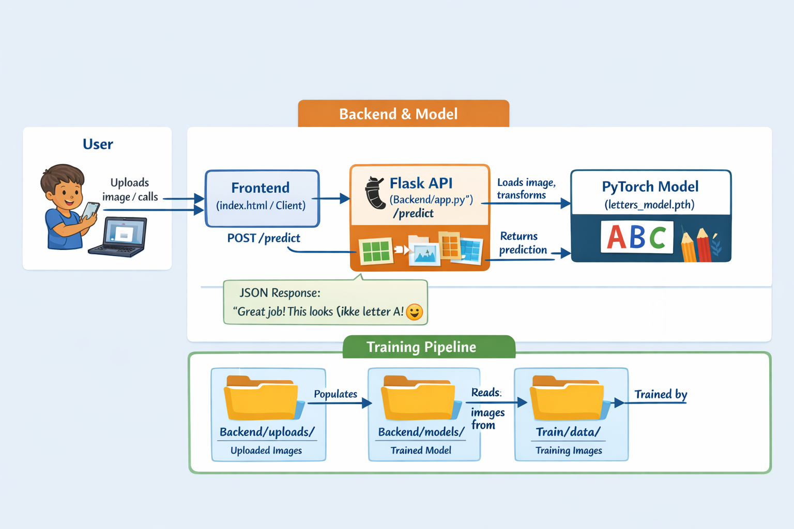

# E-Learning App Backend

This repository contains a simple letter-recognition backend and training utilities for an educational handwriting recognition app.

- **Backend/**: Flask API that serves predictions from a trained PyTorch model.
- **Train/**: Data preprocessing and training scripts used to prepare and train the model.

Quick start

1. Install dependencies (adjust for your environment):

```bash
pip install -r Backend/requirments.txt
```

2. To run the API server:

```bash
python Backend/app.py
```

3. To prepare data and train a model:

```bash
# inside Train/ directory
python map.py    # organizes images into Train/data/<LETTER>/ using english.csv
python train.py  # trains a ResNet-18 model and saves weights
```

Project layout

- Backend/app.py — Flask app exposing `/predict` endpoint
- Backend/index.html — example front-end test page
- Backend/models/letters_model.pth — trained model weights used by the API
- Backend/uploads/ — temporary uploaded images saved by the API
- Train/map.py — CSV→folder mapping script
- Train/train.py — training script using torchvision models
- Train/data/ — letter-wise image dataset generated by `map.py`

Notes

- The Flask app expects the model at `Backend/models/letters_model.pth` and uses CPU by default.
- The training script saves `digits_model.pth` in the `Train/` folder; you may rename/move it for the backend.

If you want, I can also add example commands to convert or move trained weights into `Backend/models/` and update the code to load different weight filenames.

**Architecture & Flow**



## Below is a high-level architecture diagram and request flow for the project. 


## Sequence Diagram:


User -> Frontend -> Flask API (/predict) -> PyTorch Model (Backend/models/letters_model.pth)
									^                                   |
									|                                   v
							Backend/uploads                  Train scripts -> Train/data
```

Where to look

- Endpoint logic: [Backend/app.py](Backend/app.py)
- Model weights: [Backend/models/letters_model.pth](Backend/models/letters_model.pth)
- Data preparation: [Train/map.py](Train/map.py) and [Train/train.py](Train/train.py)

If you'd like an actual PNG/SVG image, I can generate and add `Backend/architecture.png` and embed it here. Otherwise, the Mermaid diagrams above should render on many repository viewers.